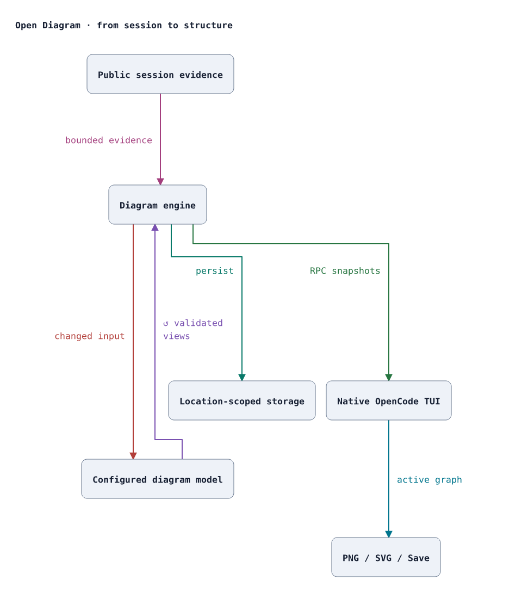
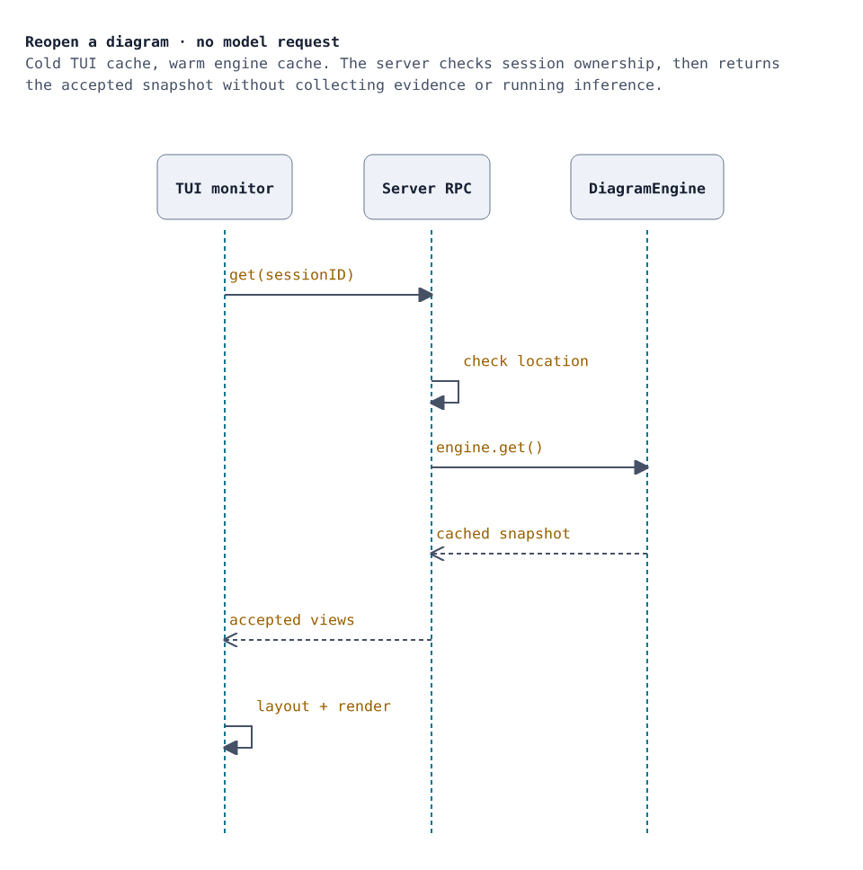

# Open Diagram

**Keep the architecture in view while you build.**

Open Diagram turns development context into native, interactive diagrams inside
OpenCode V2. Follow a software pipeline, inspect a firmware state machine, trace a
hardware interface, or map a circuit's pins and nets—without leaving the terminal.

It sits in the sidebar, expands when you need room, and exports clean PNG or SVG
images when the explanation needs to travel.

<picture>
  <source media="(prefers-color-scheme: dark)" srcset="docs/images/architecture-dark.png">
  
</picture>

*Open Diagram, drawn by Open Diagram. This source-linked view of the repository
uses the same renderer as the plugin's exports. [SVG](docs/images/architecture-light.svg)
· [How these images are generated](docs/images/README.md)*

## Why use it?

- **Context stays visible.** Separate views for distinct structures; select a
  block for its description, behavior, and source references.
- **Software and hardware belong together.** Architecture, flowcharts, state
  machines, classes, ER models, sequences, timing, and circuits have typed semantics.
- **You choose the author.** Use your active agent, a dedicated OpenCode model,
  or an OpenAI-compatible endpoint. No implicit paid fallback.
- **Viewing is local.** Switching views, resizing, selecting, and exporting never
  call a model. Accepted diagrams and tracking preferences survive reloads.
- **It feels like OpenCode.** Native sidebar, keyboard navigation, resizable
  panel, fullscreen, host-theme colors, and one-click Classic sidebar restoration.

## Install and set up

Requires **Node.js 22+** and **OpenCode 2.x (`>=2.0.7 <3`)**.
Current verification used **OpenCode 2.0.11**. The range admits later 2.x releases;
it does not claim every future release has already been tested.
The supported installation today is a local checkout; this repository is still
marked `private` for npm publication.

### 1. Get the plugin

```sh
git clone https://github.com/clay-m-smith/open-diagram.git
cd open-diagram
npm ci
pwd
```

Keep the absolute path printed by `pwd`. On Windows, use an absolute path with
forward slashes in JSON, such as `C:/projects/open-diagram`.

### 2. Load it in your project

Add this entry to the **target project's** `opencode.json` or `opencode.jsonc`.
Merge it into existing `plugins`; do not replace your other settings.

```json
{
  "plugins": [{
    "package": "/absolute/path/to/open-diagram",
    "options": { "backend": "manual" }
  }]
}
```

Open OpenCode in that target project. For an already running instance, reload
configuration with `opencode reload` from the target project and reopen the TUI
if its plugin entry has not appeared. `/open-diagram` opens the diagram view.

### 3. Choose the model that draws your diagrams

| Mode | Who authors the diagram? | What to configure |
| --- | --- | --- |
| **Manual** (default) | Your active agent or an external author, via snapshot/publish tools | `backend: "manual"` |
| **OpenCode model** | A dedicated model available in your target project's OpenCode catalog | `backend: "opencode"`, `providerID`, `model`; optional `variant` |
| **Compatible endpoint** | A model served by a local or explicitly allowed remote API | `backend: "openai-compatible"`, `baseURL`, `model` |

For automatic diagrams, connect the provider in OpenCode using `/connect`, then
inspect the available catalog with `opencode models` from the target project.
Use real IDs from that catalog—not a guessed model name. Replace the manual
entry's options with:

```json
{
  "backend": "opencode",
  "providerID": "YOUR_PROVIDER_ID",
  "model": "YOUR_MODEL_ID"
}
```

**These are plugin options, not OpenCode's top-level `model` setting.** They select
only the diagram author; your chat, agent, and worker routing stay unchanged.
Credentials come from OpenCode. Automatic generation can incur provider charges.
The model must reliably produce structured JSON and understand the domain you
are diagramming; no particular provider or model is required.

See the **[numbered setup and model-selection guide](docs/setup.md)** for exact ID
splitting, variants, local/remote endpoints, credentials, switching models, cost
controls, and troubleshooting.

### 4. Create your first diagram

Have the agent inspect the relevant source files or discuss the design. With an
automatic backend, meaningful development activity can schedule an update; use
**Refresh** to recollect evidence explicitly. Unchanged input reuses accepted output.

In manual mode, ask your agent:

> Inspect the relevant source files. Call `open_diagram_snapshot`, follow its
> instruction and output schema, then call `open_diagram_publish` with a grounded
> diagram of this project. Use separate views where useful.

Manual means **no secondary diagram-model call**, not free primary-agent usage.
The exact [diagram publication procedure](docs/setup.md#publish-a-diagram) works
with any capable model. Refresh alone does not author diagrams in manual mode.

## Pick the notation that fits

| Family | What it preserves |
| --- | --- |
| Architecture | Nested groups, named ports, typed links, directional or bidirectional interfaces; useful for software, embedded systems, and HIL rigs |
| Flowchart | Decisions, conditions, start/end roles, fork/join structure |
| State | Initial/final states, composite groups, events, guards, actions |
| Class / ER | Typed members, visibility, primary/foreign keys, relationship kinds and cardinalities |
| Sequence | Ordered lifelines and messages, replies, self-calls, activations, labelled interaction spans |
| Timing | Digital `0/1/X/Z` and bus values with exact transition times; event-spaced, explicitly **not to scale** |
| Circuit | Component references and values, numbered pins, scoped multi-terminal nets, NC/unassigned pins, explicit junctions |

Existing block graphs remain supported. Specialized families add validated
structure rather than relying on descriptive labels to imply meaning. These are
compact native notations, not exhaustive UML/IEC drawings or a CAD editor.

<picture>
  <source media="(prefers-color-scheme: dark)" srcset="docs/images/cached-view-dark.png">
  
</picture>

*A second view of this repository: reopening a cached diagram. The same accepted
data feeds the terminal and exports. [SVG](docs/images/cached-view-light.svg)*

## Work the way you want

| Action | Control |
| --- | --- |
| Open diagrams | `/open-diagram` |
| More room | `/open-diagram panel` or `/open-diagram fullscreen` |
| Change detail | **Overview / Granular**, or `/open-diagram overview` / `granular` |
| Track changes | **Pause / Resume / Refresh** |
| Navigate a focused panel | `j/k` select, `f` fullscreen, `p` pause/resume, `r` refresh |
| Restore OpenCode's sidebar | **Classic sidebar**, `/open-diagram sidebar`, or panel `Escape` |
| Share a diagram | **PNG / SVG / Save** |

Descriptions and **Sources** stay separate. Wide diagrams scroll rather than
clip; layout and navigation respect each family's structure. **Granular** shows
internals present in the evidence, not invented implementation detail.

Exports include the full active diagram, not terminal chrome. They follow the
host's light/dark mode by default, with a persistent **export-only** theme override.
Linux image clipboard support uses existing `wl-copy` or `xclip`; unsupported
environments get a Save fallback. Save refuses existing files and symlinks.

Read the [usage and export guide](docs/usage.md) for controls, caching behavior,
SSH clipboard requirements, and rendering limits.

## Under the hood

The server owns evidence, validation, generation, and durable state. The TUI owns
presentation. Generic graph layout uses pinned ELK.js in an isolated worker;
sequence, timing, and circuit views use deterministic family-specific geometry.
All layouts are local and shared by terminal and image rendering.

- [Server and public RPC](src/diagram/server.ts)
- [Engine and durable caches](src/diagram/engine.ts)
- [Versioned notation contracts](src/diagram/notation-schema.ts)
- [Shared layout](src/diagram/layout.ts) and [specialized geometry](src/diagram/notation-layout.ts)
- [Model-independent authoring harness](docs/harness.md)

## Develop and publish

```sh
npm ci
npm run verify       # TypeScript + unit, native TUI, and isolated runtime checks
npm run docs:images  # Regenerate this README's light/dark SVG and PNG images
npm run docs:check   # Check SVG freshness and PNG signatures/dimensions
npm pack --dry-run   # Inspect the package file list; does not publish
```

Runtime tests require `opencode` and `python3` on PATH. The native renderer test
needs Node **26.4+** with `--experimental-ffi`; it skips on older Node versions.
Tests use isolated fixture services, never paid models or the shared service.

The **[maintainer publishing guide](docs/publishing.md)** enumerates verification,
Git push, package preparation, npm publication, and consumer configuration.
Pushing Git does **not** publish to npm or change repository visibility.

## Trust and limits

Diagrams are interpretations of bounded public session evidence, not proof of
correctness or an exhaustive repository scan. Read the relevant files into the
session; image-only schematics and omitted declarations cannot be reconstructed.
Automatic backends receive those excerpts, so avoid admitting secrets.

Failed updates retain the last valid diagram with a visible warning. Accepted
graph text and citation labels persist in location-scoped plugin storage; source
excerpts are transient. Open Diagram does not read another plugin's private state
or change host model routing or theme settings.

Circuit connectivity comes from explicit pins and nets—not crossing lines.
PCB placement/routing, CAD import adapters, simulation, ERC/DRC, manufacturing
outputs, and electrical-safety certification are outside this plugin's scope.
